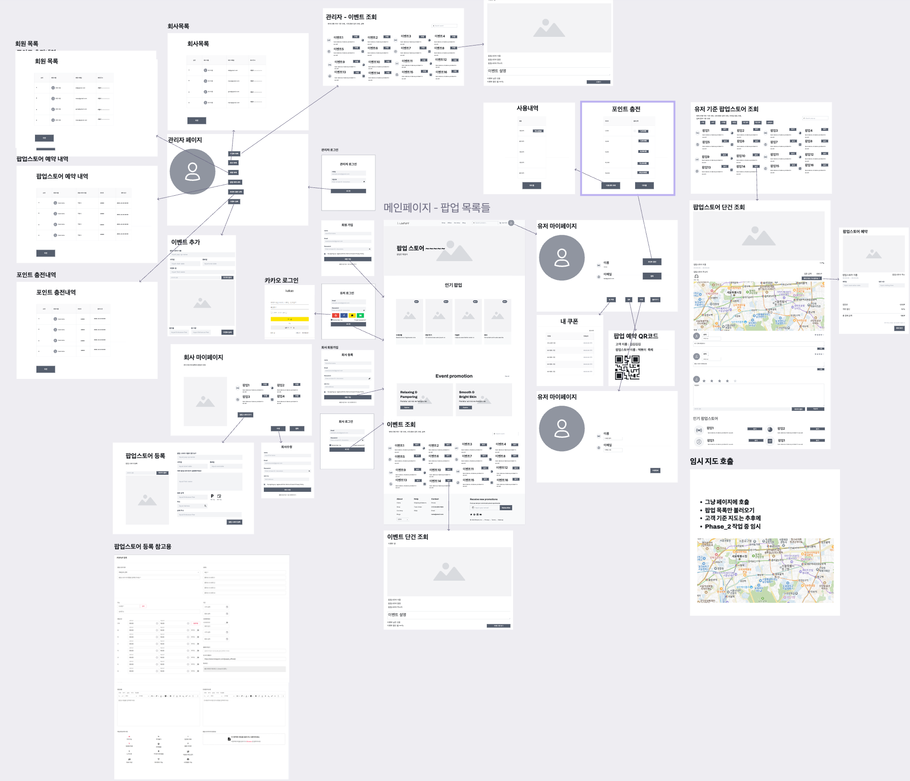
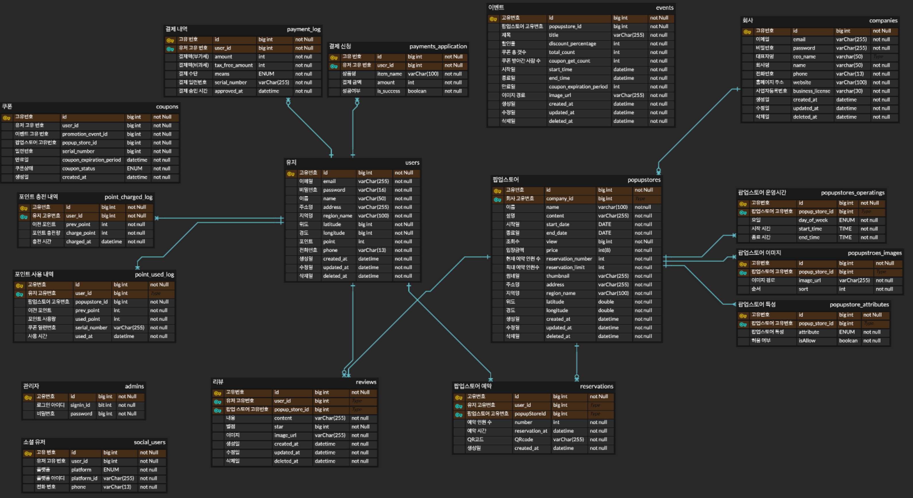

# 프로젝트명

## spotOn

-------
## 프로젝트 진행 기간

__2024.12.2-2025.1.7__

-------
## 프로젝트 설명

-------
## 팀원소개/역할

| 팀원  | 역할                         |         
|-----|----------------------------|
| 문정원 | 위치구하기, 프론트엔드, 지도 불러오기      |                         
| 권익현 | 소셜로그인 ,관리자권한확인, QR         | 
| 장용환 | 테이블 구조 조정, 팝업스토어 예약, 동시성제어 | 
| 이하승 | 실시간 로깅 및 모니터링, 이미지 업로드     |
| 김도현 | 포인트 관리, 리뷰CRUD, 팝업스토어 조회   |

-------
### 와이어프레임

-------
### erd

-------
## Api 정리

### QR Code API
| Method | Endpoint                                    | Description                        |
|--------|--------------------------------------------|------------------------------------|
| GET    | /users/mypage/qrCode                       | 유저 QR 코드 출력                 |
| GET    | /popupstores/{popupStoreId}/qrCode         | QR 코드로 유저 확인               |

---

### Promotion Events API
| Method | Endpoint                                    | Description                        |
|--------|--------------------------------------------|------------------------------------|
| GET    | /promotionEvents                           | 프로모션 이벤트 다건 조회          |
| GET    | /promotionEvents/{promotionEventId}        | 프로모션 이벤트 단건 조회          |

---

### Social Login API
| Method | Endpoint                                    | Description                        |
|--------|--------------------------------------------|------------------------------------|
| POST   | /oauth2/phone-number                       | 사용자 전화번호 연동              |
| GET    | /oauth2/signin/{platform}                  | 소셜 로그인 phase 1               |
| GET    | /oauth2/callback/{platform}                | 소셜 로그인 phase 2               |
| GET    | /oauth2/callback/{platform}/token          | 토큰 테스트용 API                 |

---

### Admin API
| Method | Endpoint                                    | Description                        |
|--------|--------------------------------------------|------------------------------------|
| POST   | /admins/signup                             | 관리자 회원 가입                  |
| POST   | /admins/signin                             | 관리자 로그인                     |
| POST   | /admins/promotionEvents                    | 프로모션 이벤트 추가              |
| DELETE | /admins/promotionEvents/{promotionEventId} | 프로모션 이벤트 삭제              |
| PATCH  | /admins/promotionEvents/{promotionEventId} | 프로모션 이벤트 수정              |
| DELETE | /admins/popupstores/{popupStoreId}         | 관리자 - 팝업스토어 삭제          |
| PATCH  | /admins/popupstores/{popupStoreId}         | 관리자 - 팝업 스토어 수정         |

---

### User API
| Method | Endpoint                                    | Description                        |
|--------|--------------------------------------------|------------------------------------|
| POST   | /users/signup                              | 유저 회원 가입                    |
| POST   | /users/signin                              | 유저 로그인                       |
| DELETE | /users                                     | 유저 회원 탈퇴                    |
| PATCH  | /users                                     | 유저 정보 수정                    |
| GET    | /users/mypage                              | 유저 마이페이지                   |
| GET    | /users/mypage/{userId}                     | 고객 주소 지도 API 임시           |
| GET    | /users/coupons                             | 유저 내 쿠폰보기                  |

---

### Reservation API
| Method | Endpoint                                    | Description                        |
|--------|--------------------------------------------|------------------------------------|
| POST   | /reservations/popupstores/{popupStoreId}   | 팝업스토어 예약                  |
| DELETE | /reservations/{reservationId}              | 팝업스토어 예약 취소              |

---

### S3 Bucket API
| Method | Endpoint                                    | Description                        |
|--------|--------------------------------------------|------------------------------------|
| GET    | /{directory}/images/preassigned            | 리뷰 & 프로모션 이벤트 이미지 URL  |
| GET    | /popup-stores/images/preassigned           | 팝업스토어 이미지 URL             |
| DELETE | /images                                    | S3에 저장된 이미지 삭제           |

---

### Review API
| Method | Endpoint                                    | Description                        |
|--------|--------------------------------------------|------------------------------------|
| GET    | /reviews/popupstores/{popupStoreId}        | 리뷰 조회                         |
| POST   | /reviews/popupstores/{popupStoreId}        | 리뷰 생성                         |
| DELETE | /reviews/{reviewId}                        | 리뷰 삭제                         |
| PATCH  | /reviews/{reviewId}                        | 리뷰 수정                         |

---

### Kakao Address API
| Method | Endpoint                                    | Description                        |
|--------|--------------------------------------------|------------------------------------|
| GET    | /kakaoapi                                  | 카카오 주소 API                   |

---

### Points API
| Method | Endpoint                                    | Description                        |
|--------|--------------------------------------------|------------------------------------|
| GET    | /users/point/charge                        | 포인트 충전내역 조회              |
| POST   | /users/point/charge                        | 포인트 충전                       |
| GET    | /users/point/used                          | 포인트 사용내역 조회              |

---

### Coupon API
| Method | Endpoint                                    | Description                        |
|--------|--------------------------------------------|------------------------------------|
| POST   | /coupons/{promotionEventId}/coupons        | 프로모션 이벤트 쿠폰 발급         |

---

### Popup Store API
| Method | Endpoint                                    | Description                        |
|--------|--------------------------------------------|------------------------------------|
| GET    | /popupstores                               | 임시 팝업 전체 조회               |
| POST   | /popupstores                               | 팝업스토어 생성                   |
| GET    | /popupstores/{popupStoreId}               | 팝업스토어 단건 조회              |
| DELETE | /popupstores/{popupStoreId}               | 팝업스토어 삭제                   |
| PATCH  | /popupstores/{popupStoreId}               | 팝업스토어 수정                   |
| GET    | /popupstores/search/{popupStoreStatus}    | 특정 상태 팝업스토어 조회         |
| GET    | /popupstores/period                       | 팝업스토어 날짜별 조회            |
| GET    | /popupstores/month                        | 이번달 팝업스토어 조회            |

---

### Company API
| Method | Endpoint                                    | Description                        |
|--------|--------------------------------------------|------------------------------------|
| POST   | /companies/signup                          | 회사 회원 가입                    |
| POST   | /companies/signin                          | 회사 로그인                       |
| DELETE | /companies                                 | 회사 회원 탈퇴                    |
| PATCH  | /companies                                 | 회사 정보 수정                    |
| GET    | /companies/popupstores                    | 회사 자사 팝업스토어 조회         |
| GET    | /companies/mypage                         | 회사 마이페이지                   |

-------
## 기술
- 도커   
- aws s3   
- 스프링부트   
- Jwt   
- 스웨거   
- 깃액션